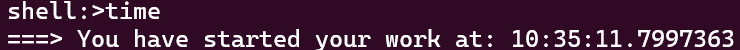
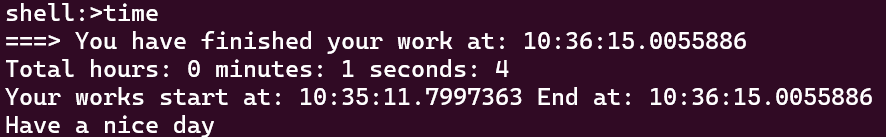

# Time Tracker
Easy to use, and help you to track your start and end time in the CMD. 
## How to use
Clone this source, and run command as follows: 
``mvn clean install -DskipTests``

After that, add your ``.jar`` file you have built in your command prompt and type: **tracker**.

## Feature 
- Help you track your start time/end time 
- Help you calculate total hour, minute, and second. 

## Tech used
- Spring shell
- Java 21

## Result
``shel:>time`` (as the first time it will print your start time of your work)

And after you finish your work just type like the previous **"time"**, it will print the end time, total hours, minutes and second for you.

### Contribute
Your contribution is very helpful for me to improve this project. Feel free to contact me if you want improve this project and help me to make it more popular. 

**Email:** nhoang2929@gmail.com